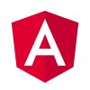

 ## Curso de Angular. Año 2021.

 

### Acceso al curso.
El curso se va a impartir de forma telemática mediante la herramienta https://dgad.webex.com/
En determinados momentos podríamos utilizar google meet.

### Recomendaciones de hardware para seguir el curso.

* Ordenador con un procesador al menos intel i3.
* Sería recomendable tener 8Gb.
* Habría que tener en el disco duro al menos 10 Gb de espacio.
* Se recomienda tener un disco duro ssd.
* Las últimas versiones de NodeJs, exigen windows 10 en los equipos con windows.
* Sería bueno tener micrófono para poder intervenir en las sesiones formativas.

### Accesos a internet
* La documentación y recursos para seguir el curso, están en:
https://github.com/jucarlos/apuntesCursoAngular ,

* Acceso para descargar el software que se utilizará.

### Software que utilizaremos para el desarrollo de los ejercicios del curso

Este el el software que se utilizará en el curso. Hace falta tener permisos de administración para su instalación.

* Visual Studio Code. https://code.visualstudio.com/
Será el editor de código que vamos a utilizar durante todos los ejercicio.

* Git. Para el control de versiones
https://git-scm.com/ 

* Cuenta en https://github.com/. En el ejercicio principal del curso utilizaremos git para el control de versiones. No es un curso de git pero se utilizarán los principales comandos.

* NodeJs. Es un entorno de ejecución de javascript. De esta parte necesitamos el gestor de paquetes npm que viene con node. Es algo así como maven.
 https://nodejs.org/es/

* Utilizaremos PostMan (https://www.postman.com/ ) para probar los servicios Rest.

* Instalaremos TypeScript . https://www.typescriptlang.org/

* Por último y como no puede ser de otra forma, instalaremos angular. https://angular.io/

#### Contenido del curso

1.	Introducción a TypeScrypt.
2.	Estructura y programación de aplicaciones angular
3.	Componentes, servicios y pipes.
4.	Navegación entre páginas. Rutas.
5.	Peticiones Http. Firebase.
6.	Formularios en angular
7.	Aplicación CRUD con peticiones a un backend.
8.	Preparar aplicación para producción.

9.	Optimización de aplicación. Módulos y Lazy Load.
10. Interceptores

Estos dos últimos puntos no forman parte del contenido del curso pero igualmente haremos un ejercicio por cada uno de esos puntos. De la misma forma tendrán todo el código disponible para su consulta.

### Dirección General de Administración digital.